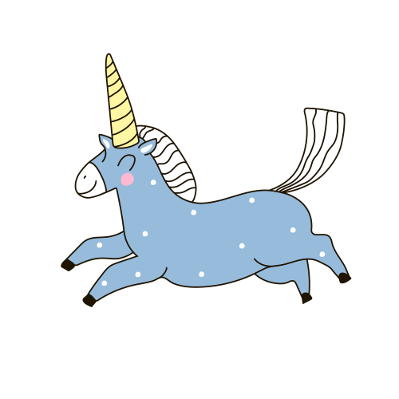

# Open Science unicorn resources 

#### Tailored for Neuro-AI students

The goal of this repository is to gather resources for students working at the intersection of Neuro-AI to make the process of their research more transparent, reproducible, and open. This repository was initiated as part of the UNIQUE Student Symposium workshop on open science June 8th 2021.
  

